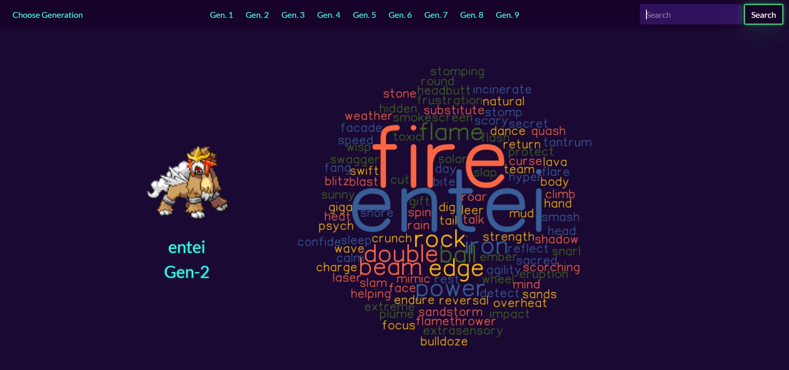

# poke-info-generator

## Description

The Pokémon info generator project provides a fun and convenient way to view Pokémon information as it pertains to the video game series with just the click of a button or by a search entry. Once a pokemon is found and selected, the user is presented with a page that displays that Pokémon’s picture, name, and generation in an information card, as well as a colorful word cloud that consists of the Pokémon’s name, type, and move set. The application was built using the core front-end technologies (HTML, CSS, and Javascript), Bootswatch CSS framework, and two server-side API's (PokeAPI and Word Cloud API).

**Some pokemon do not appear in search results as the API did not contain information for these pokemon. The list is as follows:

Deoxys,
Giratina,
Shaymin,
Wormadam,
Basculin,
Darmanitan,
Keldeo,
Landorus,
Meloetta,
Thundurus,
Tornadus,
Aegislash
Gourgeist
Meowstic,
Pumpkaboo,
Zygarde,
Lycanroc,
Mimikyu,
Minior,
Oricorio,
Wishiwashi,
Basculegion,
Eiscue,
Enamorus,
Indeedee,
Morpeko,
Toxtricity,
Urshifu

[Poke Info Generator](https://codehashira28.github.io/poke-info-generator/)

## Installation

N/A

## Usage

The home page presents the user with an interactive UI in which they can either search for a pokemon by name in the search bar or via the generations tabs at the top of the page. Once a pokemon is selected, an information page is then presented with the pokemon's image, name, and generation along with a word cloud that consists of the pokemon's name, type, and move-set. The user can then either click the "Back" button to return to the previous page or click the "Pokemon" title heading to be returned to the home page. If returned tp the homepage, the user will be able to see all previously viewed pokemon in a "History" section where the pokemon can be clicked again and the user re-presented with the info page for that pokemon. If the user wants to randomly select a pokemon to view from generations 1,2, or 9, the "Choose Generation" button itself can be clicked and the user will be given a random pokemon to view information for.

## Credits

Project Contributor - [James Belcher](https://github.com/Tankb220)

[Word Cloud API](https://wordcloudapi.com/)

[Pokemon API](https://pokeapi.co/)

